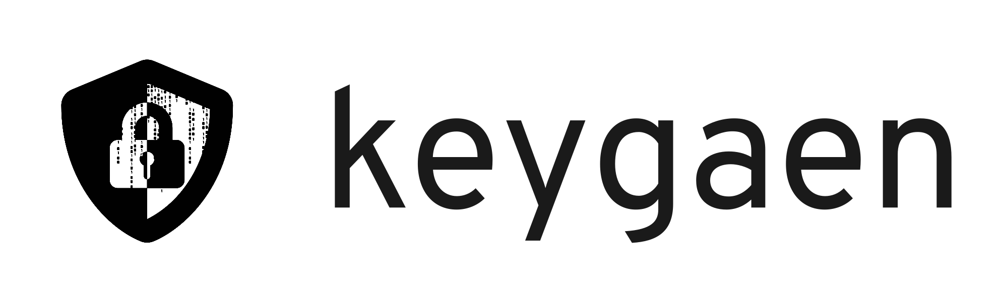
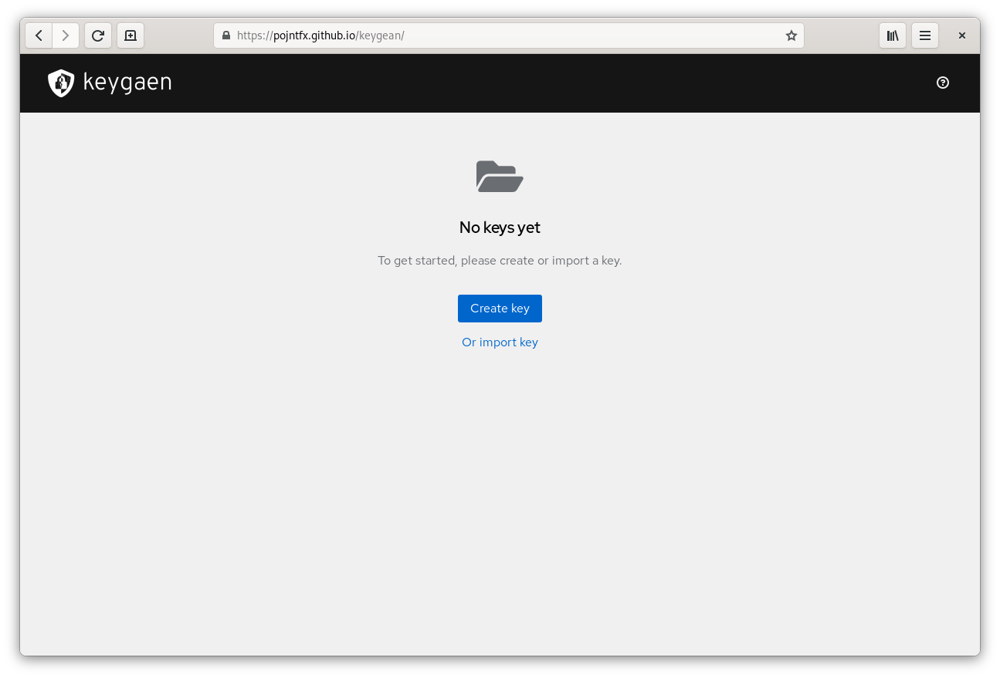
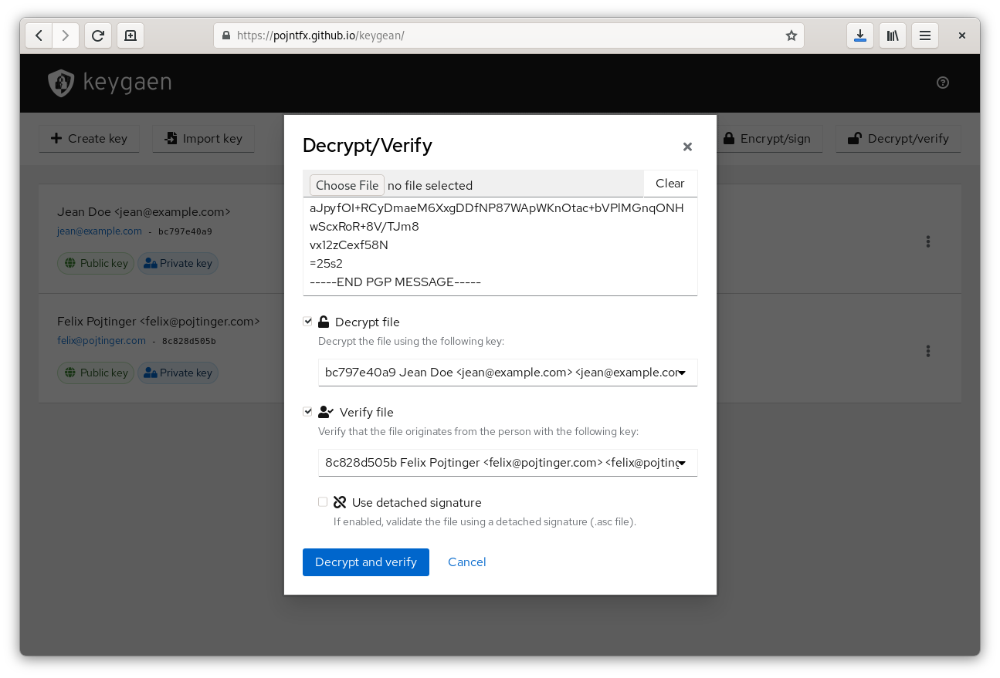
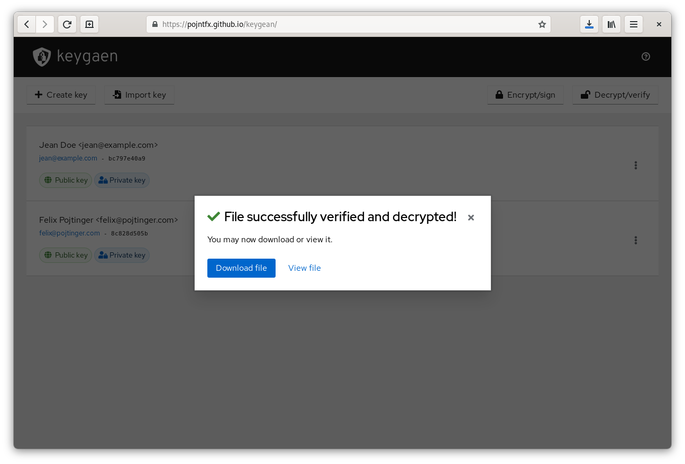
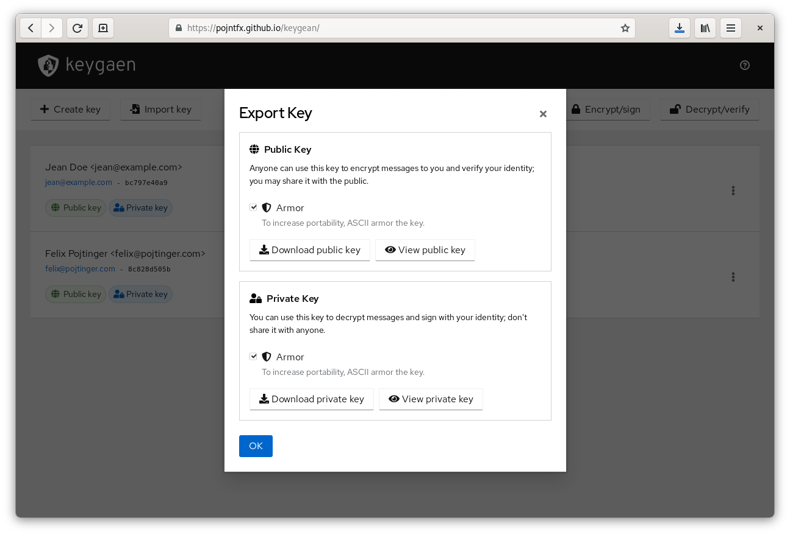

# keygaen



Sign, verify, encrypt and decrypt data with PGP in your browser.

⚠️ keygaen has not yet been audited! While we try to make keygaen as secure as possible, it has not yet undergone a formal security audit by a third party. Please keep this in mind if you use it for security-critical applications. ⚠️

[](https://github.com/pojntfx/keygaen/actions/workflows/hydrun.yaml)

[](https://pkg.go.dev/github.com/pojntfx/keygaen)
[](https://matrix.to/#/#keygaen:matrix.org?via=matrix.org)
[](https://github.com/pojntfx/keygaen/releases)

## Overview

keygaen is an app to work with PGP without having to install anything on your local system.

## Installation

The web app is available on [GitHub releases](https://github.com/pojntfx/keygaen/releases) in the form of a static `.tar.gz` archive; to deploy it, simply upload it to a CDN or copy it to a web server. For most users, this shouldn't be necessary though; thanks to [@maxence-charriere](https://github.com/maxence-charriere)'s [go-app package](https://go-app.dev/), keygaen is a progressive web app. By simply visiting the [public deployment](https://pojntfx.github.io/keygaen/) once, it will be available for offline use whenever you need it:

[](https://pojntfx.github.io/keygaen/)

## Screenshots

Click on an image to see a larger version.

<a display="inline" href="./docs/empty.png?raw=true">

</a>

<a display="inline" href="./docs/key-create.png?raw=true">

</a>

<a display="inline" href="./docs/key-import.png?raw=true">

</a>

<a display="inline" href="./docs/key-list.png?raw=true">

</a>

<a display="inline" href="./docs/encrypt-sign.png?raw=true">

</a>

<a display="inline" href="./docs/view-cypher.png?raw=true">

</a>

<a display="inline" href="./docs/download-cypher.png?raw=true">

</a>

<a display="inline" href="./docs/decrypt-verify.png?raw=true">

</a>

<a display="inline" href="./docs/view-plaintext.png?raw=true">

</a>

<a display="inline" href="./docs/download-plaintext.png?raw=true">

</a>

<a display="inline" href="./docs/export-key.png?raw=true">

</a>

## Acknowledgements

- This project would not have been possible were it not for [@maxence-charriere](https://github.com/maxence-charriere)'s [go-app package](https://go-app.dev/); if you enjoy using keygaen, please donate to him!
- The open source [PatternFly design system](https://www.patternfly.org/v4/) provides the components for the project.
- [GopenPGP](https://gopenpgp.org/) is the PGP library in use.

## Contributing

To contribute, please use the [GitHub flow](https://guides.github.com/introduction/flow/) and follow our [Code of Conduct](./CODE_OF_CONDUCT.md).

To build and start a development version of keygaen locally, run the following:

```shell
$ git clone https://github.com/pojntfx/keygaen.git
$ cd keygaen
$ make depend
$ make run-pwa/keygaen-pwa
```

Have any questions or need help? Chat with us [on Matrix](https://matrix.to/#/#keygaen:matrix.org?via=matrix.org)!

## License

keygaen (c) 2023 Felicitas Pojtinger and contributors

SPDX-License-Identifier: AGPL-3.0
